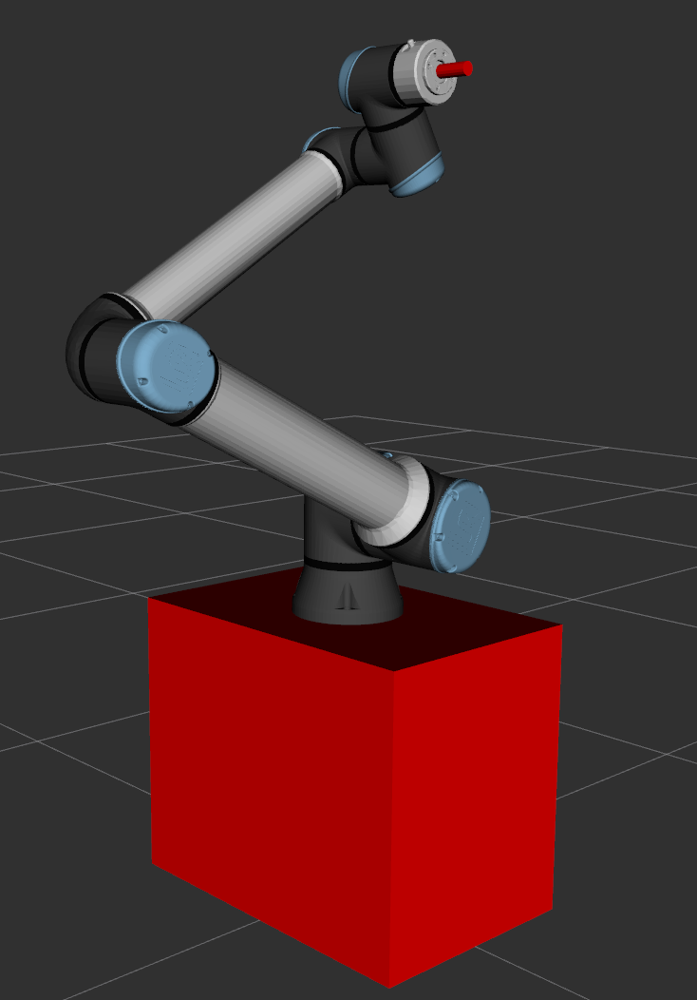
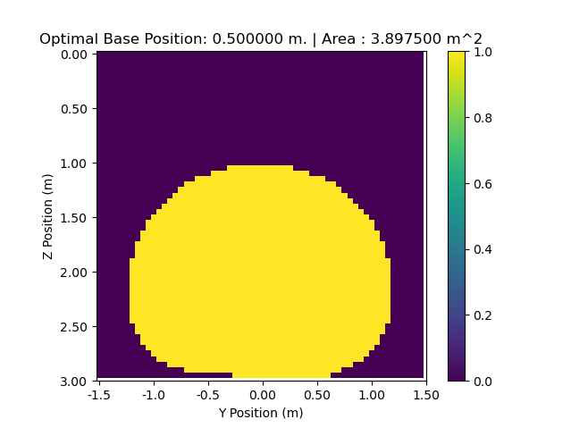

### TO DO: 
Edit the readme

## Reachability Analysis

### Introduction
  

Reachability Analysis is what .... , why is it needed -> to make sure the robot arm reaches the place. make this more technical. 


sadas
'asd
asdas
d
asd
asd
asd
asd
asd
asd
asd
a

sd
asds
asd
a

ssds
as


das
d
as

d
as
das

d

da

sas
da

sd
asd
asd
asd

as
dasd

aasd


In this project, omptimal distance of manipulator base from a wide wall is found. the manipulator is a Universal Robots UR10e mounted atop a base, and attached to it a tool. 


A "newline". This text doesn't float anymore, is left-aligned.


The approach was to discritize the walls into square cells, check if the cells are reachable by using moveit2 ik and collision checking for self collision free configuration. 


### Setup
#### 1. Create a workspace - directory ws_name / src
#### 2. Clone the repo inside src

```
git clone 

```

#### 3. Use rosdep to install the dependencies
 `rosdep install --from-paths src -y --ignore-src`

#### 4. Build the workspace using colcon build. 


#### NOTE: Due to an error, i excplicitly mentioned my python version in reachability_analysis/CMakeLists.txt , in case of errors please change to the version of python in your PC. 
### Launch
After building and sourcing, use command: `ros2 launch ur_10_desc_moveit mv_robot.launch.py`
Note: The code will take some time generate plots, takes 3-4 minutes to run in mine.


#### Expected output
While running the following should be visibile 

```[reach_node-1] [INFO] [1743682248.033268313] [moveit_rdf_loader.rdf_loader]: Loaded robot model in 0.00117889 seconds
[reach_node-1] [INFO] [1743682248.033348253] [moveit_robot_model.robot_model]: Loading robot model 'ur'...
[reach_node-1] [INFO] [1743682248.060766116] [reach_node]: Model frame: world
[reach_node-1] [INFO] [1743682248.060903374] [reach_node]: Robot kinematic model loaded
[reach_node-1] [INFO] [1743682248.065429155] [reach_node]: Checking reachable cells. Distance from wall: 0.150000
[reach_node-1] [INFO] [1743682258.428470844] [reach_node]: Reachable cells: : 1266 , Distance from the wall: 0.150000
[reach_node-1] 
[reach_node-1] 
[reach_node-1] [INFO] [1743682258.428557347] [reach_node]: Checking reachable cells. Distance from wall: 0.200000
[reach_node-1] [INFO] [1743682267.926451756] [reach_node]: Reachable cells: : 1390 , Distance from the wall: 0.200000
[reach_node-1] 
[reach_node-1] 
[reach_node-1] [INFO] [1743682267.926527539] [reach_node]: Checking reachable cells. Distance from wall: 0.250000
[reach_node-1] [INFO] [1743682277.561206716] [reach_node]: Reachable cells: : 1337 , Distance from the wall: 0.250000
[reach_node-1] 
[reach_node-1] 
[reach_node-1] [INFO] [1743682277.561276237] [reach_node]: Checking reachable cells. Distance from wall: 0.300000
[reach_node-1] [INFO] [1743682287.231314836] [reach_node]: Reachable cells: : 1292 , Distance from the wall: 0.300000
[reach_node-1] 
[reach_node-1] 
[reach_node-1] [INFO] [1743682287.231391420] [reach_node]: Checking reachable cells. Distance from wall: 0.350000
[reach_node-1] [INFO] [1743682297.016638345] [reach_node]: Reachable cells: : 1390 , Distance from the wall: 0.350000
[reach_node-1] 
[reach_node-1] 
[reach_node-1] [INFO] [1743682297.016965211] [reach_node]: Checking reachable cells. Distance from wall: 0.400000
[reach_node-1] [INFO] [1743682307.035080901] [reach_node]: Reachable cells: : 1379 , Distance from the wall: 0.400000
[reach_node-1] 
[reach_node-1] 
[reach_node-1] [INFO] [1743682307.035173886] [reach_node]: Checking reachable cells. Distance from wall: 0.450000
[reach_node-1] [INFO] [1743682317.218603780] [reach_node]: Reachable cells: : 1500 , Distance from the wall: 0.450000
[reach_node-1] 
[reach_node-1] 
[reach_node-1] [INFO] [1743682317.218674293] [reach_node]: Checking reachable cells. Distance from wall: 0.500000
[reach_node-1] [INFO] [1743682327.615140248] [reach_node]: Reachable cells: : 1559 , Distance from the wall: 0.500000

```
(will run till distance from wall = 1.4 m.)


The resultant wall plot for best position should be like this:
<!--  -->
 fix this


And the terminal output should look like this(please increase to full screen to see full width):

```
[reach_node-1] [INFO] [1743682565.995208972] [reach_node]: Depth: 0.350000, Reachable cells: 1390
[reach_node-1] [INFO] [1743682565.995214533] [reach_node]: 
[reach_node-1] X X X X X X X X X X X X X X X X X X X X X X X X X X X X X X X X X X X X X X X X X X X X X X X X X X X X X X X X X X X X 
[reach_node-1] X X X X X X X X X X X X X X X X X X X X X X X X X X X X X X X X X X X X X X X X X X X X X X X X X X X X X X X X X X X X 
[reach_node-1] X X X X X X X X X X X X X X X X X X X X X X X X X X X X X X X X X X X X X X X X X X X X X X X X X X X X X X X X X X X X 
[reach_node-1] X X X X X X X X X X X X X X X X X X X X X X X X X X X X X X X X X X X X X X X X X X X X X X X X X X X X X X X X X X X X 
[reach_node-1] X X X X X X X X X X X X X X X X X X X X X X X X X X X X X X X X X X X X X X X X X X X X X X X X X X X X X X X X X X X X 
[reach_node-1] X X X X X X X X X X X X X X X X X X X X X X X X X X X X X X X X X X X X X X X X X X X X X X X X X X X X X X X X X X X X 
[reach_node-1] X X X X X X X X X X X X X X X X X X X X X X X X X X X X X X X X X X X X X X X X X X X X X X X X X X X X X X X X X X X X 
[reach_node-1] X X X X X X X X X X X X X X X X X X X X X X X X X X X X X X X X X X X X X X X X X X X X X X X X X X X X X X X X X X X X 
[reach_node-1] X X X X X X X X X X X X X X X X X X X X X X X X X X X X X X X X X X X X X X X X X X X X X X X X X X X X X X X X X X X X 
[reach_node-1] X X X X X X X X X X X X X X X X X X X X X X X X X X X X X X X X X X X X X X X X X X X X X X X X X X X X X X X X X X X X 
[reach_node-1] X X X X X X X X X X X X X X X X X X X X X X X X X X X X X X X X X X X X X X X X X X X X X X X X X X X X X X X X X X X X 
[reach_node-1] X X X X X X X X X X X X X X X X X X X X X X X X X X X X X X X X X X X X X X X X X X X X X X X X X X X X X X X X X X X X 
[reach_node-1] X X X X X X X X X X X X X X X X X X X X X X X X X X X X X X X X X X X X X X X X X X X X X X X X X X X X X X X X X X X X 
[reach_node-1] X X X X X X X X X X X X X X X X X X X X X X X X X X X X X X X X X X X X X X X X X X X X X X X X X X X X X X X X X X X X 
[reach_node-1] X X X X X X X X X X X X X X X X X X X X X X X X X X X X X X X X X X X X X X X X X X X X X X X X X X X X X X X X X X X X 
[reach_node-1] X X X X X X X X X X X X X X X X X X X X X X X X X X X X X X X X X X X X X X X X X X X X X X X X X X X X X X X X X X X X 
[reach_node-1] X X X X X X X X X X X X X X X X X X X X X X X X X X X X X X X X X X X X X X X X X X X X X X X X X X X X X X X X X X X X 
[reach_node-1] X X X X X X X X X X X X X X X X X X X X X X X X X X X X X X X X X X X X X X X X X X X X X X X X X X X X X X X X X X X X 
[reach_node-1] X X X X X X X X X X X X X X X X X X X X X X X X X X X X X X X X X X X X X X X X X X X X X X X X X X X X X X X X X X X X 
[reach_node-1] X X X X X X X X X X X X X X X X X X X X X X X X X X X X X X X X X X X X X X X X X X X X X X X X X X X X X X X X X X X X 
[reach_node-1] X X X X X X X X X X X X X X X X X X X X X X X X X . . . . . . . . . . X X X X X X X X X X X X X X X X X X X X X X X X X 
[reach_node-1] X X X X X X X X X X X X X X X X X X X X X . . . . . . . . . . . . . . . . . . X X X X X X X X X X X X X X X X X X X X X 
[reach_node-1] X X X X X X X X X X X X X X X X X X . . . . . . . . . . . . . . . . . . . . . . . . X X X X X X X X X X X X X X X X X X 
[reach_node-1] X X X X X X X X X X X X X X X X . . . . . . . . . . . . . . . . . . . . . . . . . . . . X X X X X X X X X X X X X X X X 
[reach_node-1] X X X X X X X X X X X X X X X . . . . . . . . . . . . . . . . . . . . . . . . . . . . . . X X X X X X X X X X X X X X X 
[reach_node-1] X X X X X X X X X X X X X . . . . . . . . . . . . . . . . . . . . . . . . . . . . . . . . . . X X X X X X X X X X X X X 
[reach_node-1] X X X X X X X X X X X X . . . . . . . . . . . . . . . . . . . . . . . . . . . . . . . . . . . . X X X X X X X X X X X X 
[reach_node-1] X X X X X X X X X X X . . . . . . . . . . . . . . . . . . . . . . . . . . . . . . . . . . . . . . X X X X X X X X X X X 
[reach_node-1] X X X X X X X X X X . . . . . . . . . . . . . . . . . . . . . . . . . . . . . . . . . . . . . . . . X X X X X X X X X X 
[reach_node-1] X X X X X X X X X . . . . . . . . . . . . . . . . . . . . . . . . . . . . . . . . . . . . . . . . . . X X X X X X X X X 
[reach_node-1] X X X X X X X X X . . . . . . . . . . . . . . . . . . . . . . . . . . . . . . . . . . . . . . . . . . X X X X X X X X X 
[reach_node-1] X X X X X X X X . . . . . . . . . . . . . . . . . . . . . . . . . . . . . . . . . . . . . . . . . . . . X X X X X X X X 
[reach_node-1] X X X X X X X . . . . . . . . . . . . . . . . . . . . . . . . . . . . . . . . . . . . . . . . . . . . . . X X X X X X X 
[reach_node-1] X X X X X X X . . . . . . . . . . . . . . . . . . . . . . . . . . . . . . . . . . . . . . . . . . . . . . X X X X X X X 
[reach_node-1] X X X X X X . . . . . . . . . . . . . . . . . . . . . . . . . . . . . . . . . . . . . . . . . . . . . . . . X X X X X X 
[reach_node-1] X X X X X X . . . . . . . . . . . . . . . . . . . . . . . . . . . . . . . . . . . . . . . . . . . . . . . . X X X X X X 
[reach_node-1] X X X X X X . . . . . . . . . X X . . . . . . . . . . . . . . . . . . . . . . . . . . . . . . . . . . . . . X X X X X X 
[reach_node-1] X X X X X . . . . . . . . . . X X . . . . . . . . . . . . . . . . . . . . . . . . . . . . . . . . . . . . . . X X X X X 
[reach_node-1] X X X X X . . . . . . . . . . X X . . . . . . X . . . . . . . . . . . . . . . . . . . . . . . . . . . . . . . X X X X X 
[reach_node-1] X X X X X . . . . . . . . . . X X . . . . . . X . . . . . . . . . . . . . . . . . . . . . . . . . . . . . . . X X X X X 
[reach_node-1] X X X X X . . . . . . . . . . X X . . . . . . X . . X . . . . . . . . . . . . . . . . . . . . . . . . . . . . X X X X X 
[reach_node-1] X X X X X . . . . . . . . . . X X . . . . . . X . . X . . . . . . . . . . . . . . . . . . . . . . . . . . . . X X X X X 
[reach_node-1] X X X X X . . . . . . . . . . X X . . . . . . X . . X . . . . . . . . . . . . . . . . . . . . . . . . . . . . X X X X X 
[reach_node-1] X X X X X . . . . . . . . . . X X . . . . . . X . X X . . . . . . . . . . . . . . . . . . . . . . . . . . . . X X X X X 
[reach_node-1] X X X X X . . . . . . . . . . X X . . . . . . X . X X . . . . . . . . . . . . . . . . . . . . . . . . . . . . X X X X X 
[reach_node-1] X X X X X . . . . . . . . . . X X . . . . . . X . X X . . . . . . . . . . . . . . . . . . . . . . . . . . . . X X X X X 
[reach_node-1] X X X X X . . . . . . . . . . X X . . . . . X X X X X X X X X X X X X X X X . . . . . . . . . . . . . . . . . X X X X X 
[reach_node-1] X X X X X . . . . . . . . . . X X . . . . . X X X X X X X X X X X X X X X X . . . . . . . . . . . . . . . . . X X X X X 
[reach_node-1] X X X X X . . . . . . . . . . X X . . . . . X X X X X X X X X X X X X X X X . . . . . . . . . . . . . . . . . X X X X X 
[reach_node-1] X X X X X . . . . . . . . . . X X . . . . . X X X X X X X X X X X X X X X X . . . . . . . . . . . . . . . . . X X X X X 
[reach_node-1] X X X X X X . . . . . . . . . X X . . . . . X X X X X X X X X X X X X X X X . . . . . . . . . . . . . . . . X X X X X X 
[reach_node-1] X X X X X X . . . . . . . . . X X . . . . . X X X X X X X X X X X X X X X X . . . . . . . . . . . . . . . . X X X X X X 
[reach_node-1] X X X X X X . . . . . . . . . X X . . . . . X X X X X X X X X X X X X X X X . . . . . . . . . . . . . . . . X X X X X X 
[reach_node-1] X X X X X X X . . . . . . . . X X . . . . . X X X X X X X X X X X X X X X X . . . . . . . . . . . . . . . X X X X X X X 
[reach_node-1] X X X X X X X X . . . . . . . X X . . . . . X X X X X X X X X X X X X X X X . . . . . . . . . . . . . . X X X X X X X X 
[reach_node-1] X X X X X X X X . . . . . . . X X . . . . . X X X X X X X X X X X X X X X X . . . . . . . . . . . . . . X X X X X X X X 
[reach_node-1] X X X X X X X X X . . . . . . X X . . . . . X X X X X X X X X X X X X X X X . . . . . . . . . . . . . X X X X X X X X X 
[reach_node-1] X X X X X X X X X X X . . . . X X . . . . . X X X X X X X X X X X X X X X X . . . . . . . . . . . X X X X X X X X X X X 
[reach_node-1] X X X X X X X X X X X X X . . X X . . . X X X X X X X X X X X X X . X X X X X X . . . . . . . X X X X X X X X X X X X X 
[reach_node-1] X X X X X X X X X X X X X X X X X X X X X X X X X X X X X X X X X X X X X X X X X X X X X X X X X X X X X X X X X X X X 
[reach_node-1] 
[reach_node-1] 

```

#### References
1. https://moveit.picknik.ai/main/doc/examples/examples.html#using-moveit-directly-through-the-c-api
2. https://moveit.picknik.ai/main/doc/examples/setup_assistant/setup_assistant_tutorial.html
3. UR 10 official description
4. https://github.com/lava/matplotlib-cpp/tree/master/examples


#### Acknowledgements

The folder `Universal_Robots_ROS2_Description` contains robot description files  
originally cloned from [PickNik’s Universal Robots ROS 2 Descriptions repository](https://github.com/PickNikRobotics/Universal_Robots_ROS2_Description).

- I modified some files/code and removed unused subfolders to match this project's requirements.
- The original license (BSD) is preserved in `Universal_Robots_ROS2_Description/LICENSE`.
